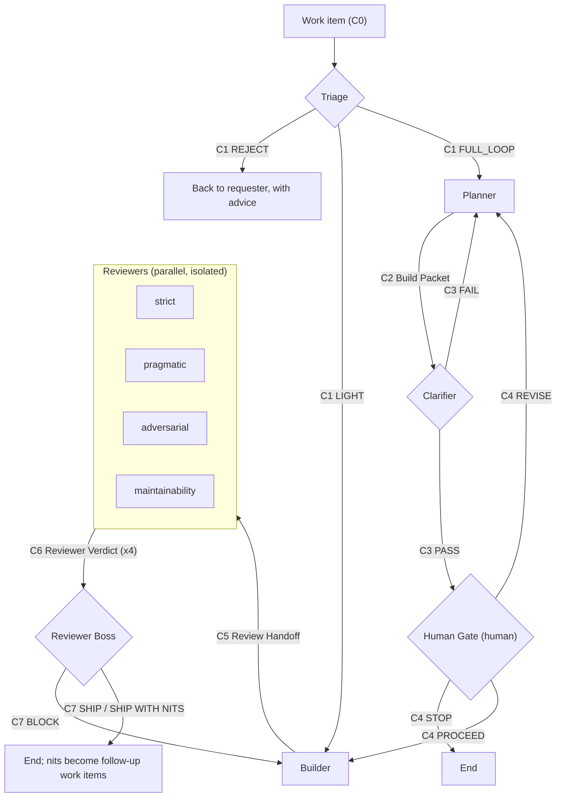

# The Role Loop

This document defines the pipeline: its stages, the contracts that flow between them, and the decision points. The rationale lives in [principles.md](principles.md). Contracts are defined in [contracts/](contracts/), role prompts in [roles/](roles/).

## Pipeline

## Stages

| Stage | Role file | Input | Output | Performed by |
|---|---|---|---|---|
| Triage | [roles/triage.md](roles/triage.md) | C0 | C1 | agent |
| Planning | [roles/planner.md](roles/planner.md) | C0, C1 | C2 | agent |
| Clarification | [roles/clarifier.md](roles/clarifier.md) | C0, C2 | C3 | agent |
| Human Gate | [roles/human-gate.md](roles/human-gate.md) | C2, C3 | C4 | **human** |
| Building | [roles/builder.md](roles/builder.md) | C2, C4 | C5 | agent |
| Review | [roles/reviewer-*.md](roles/) | C5 (core) | C6 (x4) | agents, parallel |
| Final verdict | [roles/reviewer-boss.md](roles/reviewer-boss.md) | C5 (full), C6 (all) | C7 | agent |

Four reviewer personas review the same core handoff from different postures: [strict](roles/reviewer-strict.md), [pragmatic](roles/reviewer-pragmatic.md), [adversarial](roles/reviewer-adversarial.md), and [maintainability](roles/reviewer-maintainability.md).

## Decision points

The loop has four places where the path branches:

1. **Triage (C1):** `FULL_LOOP` enters the pipeline at the Planner. `LIGHT` skips straight to the Builder with a minimal packet. `REJECT` returns the work item to the requester with advice (too small for any process, or too large and in need of splitting).
2. **Clarifier (C3):** `PASS` moves to the gate. `FAIL` returns the packet to the Planner with numbered requested edits. This cycle may repeat; if it repeats more than twice, that is a signal for the human to step in.
3. **Human Gate (C4):** `PROCEED` releases the Builder. `REVISE` sends specific changes back to the Planner. `STOP` ends the run until a human decision or external dependency is resolved. Only a human fills in C4.
4. **Final verdict (C7):** `SHIP` and `SHIP WITH NITS` end the loop (nits become follow-up work items). `BLOCK` returns to the Builder with a prioritized must-fix list; the Builder produces a new C5 and review repeats.

## Concurrency

Reviewers run in parallel and isolated from one another: each receives the same core review handoff (C5) and none sees another reviewer's verdict before completing its own. Independent perspectives are the value; sharing context would collapse them into one.

Building is sequential. Changes within a packet usually depend on each other, and two builders editing one codebase create merge conflicts instead of speed. Parallelize only what is genuinely independent.

## Scope: what fits the loop

The loop is sized for **S, M, and L** work items:

- **XS** (typos, comment fixes, config one-liners): the loop is overkill. Triage routes these to `LIGHT` or `REJECT` ("just do it").
- **S/M/L** (a bug fix, a feature slice, a refactor with clear boundaries): the sweet spot. One work item becomes one packet with one to a handful of reviewable changes.
- **XL** (multi-week features, architecture migrations): a fixed loop is not enough on its own. Triage rejects these with the advice to split them into S/M/L work items first; the splitting itself can be a planning task.

## Verification is parameterized

The Build Packet (C2) declares a verification model per change:

- `test-first` - red/green/refactor; the default for behavior changes in tested codebases.
- `validation-workflow` - a scripted or stepwise check with defined expected outcomes; suited to data work, infra, and configuration.
- `manual-with-expected-results` - concrete manual steps, each with the result that counts as success; suited to prototypes and documentation.

A packet that picks anything other than `test-first` must say why. The Builder's evidence obligations (red proof, green proof) translate to whichever model was chosen: a failing check before, a passing check after.
