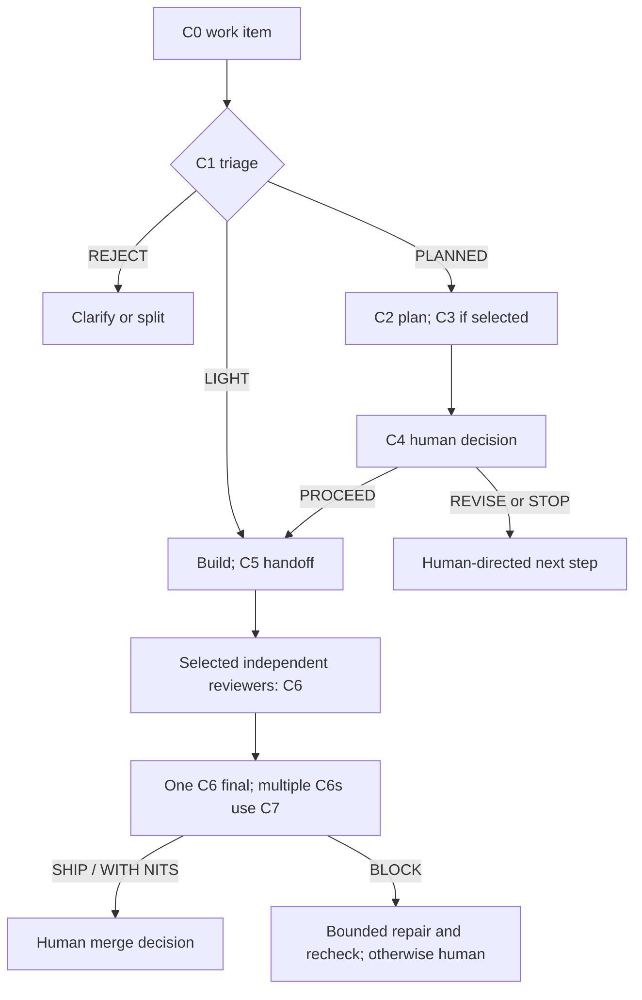

# The Role Loop

This is the single routing norm. [Principles](principles.md), [contracts](contracts/), role prompts and adapters implement it without adding routes. Core is independent of a tracker or provider.

## Pipeline

The diagram shows the main route. Role selection, exceptions and the persisted
repair limits are specified in the sections below.

```mermaid
flowchart TD
    W["C0 work item"] --> T{"C1 triage"}
    T -->|REJECT| X["Clarify or split"]
    T -->|PLANNED| P["C2 plan; C3 if selected"]
    P --> G["C4 human decision"]
    T -->|LIGHT| B["Build; C5 handoff"]
    G -->|PROCEED| B
    G -->|REVISE or STOP| H["Human-directed next step"]
    B --> V["Selected independent reviewers: C6"]
    V --> F["One C6 final; multiple C6s use C7"]
    F -->|SHIP / WITH NITS| M["Human merge decision"]
    F -->|BLOCK| R["Bounded repair and recheck; otherwise human"]
```

For LIGHT, obtain C4 first if there is a new goal, contract or norm choice,
or irreversible effects. C3 FAIL uses the design repair rule. Before a final
verdict, wait for all selected reviews. For multiple reviews, the orchestrator
synthesizes compatible judgments; the boss arbitrates substantive disagreement.
Unresolved goal or risk choices go to the human.

## Responsibilities and proportionality

The orchestrator writes C1; a separate triage agent is optional. C1 pins the process and project norm commits and readable sources, assesses size and risk, names responsibilities and executors, and assigns every acceptance criterion to a qualified reviewer. Safety, contract and shared-dependency criteria need suitable expertise. If C0 has no criteria, use PLANNED so the planner derives them for human confirmation. C2 additions require updated assignments before review.

These are starting configurations, not fixed agent counts:

| Work | Route and responsibilities | Human decision |
|---|---|---|
| Small unambiguous correction | LIGHT: builder from C0 + C1, one independent reviewer | Additional C4 before irreversible effects or new goal, contract or norm choices; human merge |
| Bounded change | PLANNED: planner researches and designs, builder, one suitable independent reviewer | C4 on concrete C2 before building |
| Substantial change with connected parts | PLANNED: planner, clarifier, builder, two independent reviewers with relevant different perspectives | C4 after plan review; XL must first be split |

C1 explains concrete uncertainty justifying clarification, extra reviewers or a separate factual inventory. A separate inventory is an identified source of C2, not a mandatory new contract. Every role weighs effort against value; the pragmatic persona is available when that additional perspective helps. Four generic reviewer perspectives remain available: strict, pragmatic, adversarial and maintainability.

LIGHT skips C2, C3 and routine C4, never independent delivery review. Do not create empty plan contracts. Its C1 supplies the concrete scope, criteria and verification steps needed with C0. REJECT returns advice for an unclear or oversized item; XS may use LIGHT. S/M/L should fit a reviewable packet; XL is split first.

## Contracts and decisions

| Stage | Inputs | Output |
|---|---|---|
| Triage | C0, applicable norms | C1 |
| Planning (PLANNED) | C0, C1, repository facts | C2 |
| Clarification (when selected) | C0, C1, C2, applicable norms | C3 |
| Human gate (when required) | concrete C2 and C3 if selected; or C0 + C1 for LIGHT | C4 |
| Building | C0 + C1 for LIGHT; C1 + C2 + C4 for PLANNED; applicable decisions and norms | C5 |
| Independent review | C5 core and assigned criteria; repair appendix only in repair mode | C6 per selected reviewer |
| Synthesis / arbitration (multiple reviewers only) | all selected C6s; full C5 for arbitration | C7 |

C3 PASS proceeds to C4; FAIL invokes the design repair rule below. C4 is a human decision: PROCEED releases the approved work, REVISE specifies changes, STOP pauses or ends it. Record the human source and exact artifact approved; do not invent approval or ask again for an already applicable decision. A changed goal, scope or risk choice needs a new human decision.

With one reviewer C6 is final. With multiple compatible reviews the orchestrator produces a traceable C7, without new findings or voting away blockers. Missing verdicts mean wait. Unresolved substantive disagreement goes to the Reviewer Boss with all C6s and full C5. Unresolved goal or risk choices go to the human. SHIP and SHIP WITH NITS mean ready for the human merge decision, never automatic merge; track deferred nits as follow-up work.

## Isolation and bounded repair

Initial reviewers start independently with C5 core, applicable norms and assigned criteria. They see neither the author's transcript nor each other's verdicts. C5 core includes relevant human decisions (including authorized deviations), objective evidence and its limits, and the exact reviewable commit. Context isolation must not hide the basis for judgment.

At most one automatic repair round is allowed for design and one for delivery per work item, including re-review. Persist both counters (0 or 1 consumed), artifact references and findings with the work item before starting repair; a new session does not reset them. The author receives criterion-linked blockers and repairs the existing artifact; retaining the author's context is allowed. A C4 REVISE is an explicit human direction: record its bounded scope and any authorized continuation, never infer a fresh automatic allowance.

Re-review starts in a fresh reviewer context explicitly marked repair mode. For design it receives updated C2, the repair diff, prior C3 blockers and previously established unaffected coverage. For delivery it receives updated C5 core, the repair diff, prior blockers and previously established unaffected coverage, as specified in C6. Check fixes and their dependencies; label reused evidence as previously established, not newly examined. Initial-review isolation does not prohibit this explicit repair appendix.

After the allowance is consumed, continuing requires the human to choose a new bounded assignment, splitting or stopping. Scope or shared-dependency changes that invalidate evidence require explicit replanning and, where necessary, full re-review; they do not silently reset counters. A round or budget limit never clears a blocker. If a project sets a budget, record the limit and response in advance; unavailable usage is reported as unavailable.

## Verification and versioning

C2 (or C1 for LIGHT) specifies verification steps and expected outcomes: `test-first` for behavior changes in tested codebases by default, `validation-workflow` for scripted checks, or `manual-with-expected-results` for concrete manual checks. Motivate alternatives to test-first. Record observed before/after results where applicable and identify what was not established; do not manufacture failing proof for a documentation or other change where it is inapplicable.

Existing work items retain their starting route/norm version. New runs use LIGHT, PLANNED or REJECT; PLANNED replaces the former FULL_LOOP value. Upgrade core and adapters as one coherent package, never a single new contract inside an old installation. A norm change requires the applicable human decision and recorded source.
